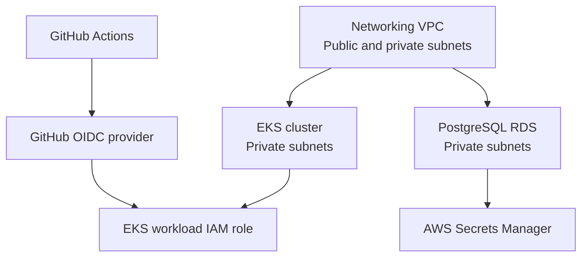

# Cloud Platform Terraform

Terraform configuration for a small AWS cloud platform. The repository currently defines a development environment composed of a VPC, an Amazon EKS cluster, IAM integrations, and a private PostgreSQL RDS database.

## Architecture



The development environment uses the `ap-south-1` region, a `10.0.0.0/16` VPC, two availability zones, separate public and private subnets, and one NAT gateway per availability zone. EKS nodes run in private subnets. RDS is private and accepts PostgreSQL traffic from the VPC CIDR.

## Repository Layout

```text
.
|-- bootstrap/terraform-state/  Reserved for remote-state bootstrap
|-- environments/
|   |-- dev/                    Active development environment
|   `-- prod/                   Production environment placeholder
|-- modules/
|   |-- eks/                    EKS cluster and managed node group
|   |-- iam/                    GitHub OIDC and EKS workload IAM
|   |-- monitoring/             Module placeholder
|   |-- networking/             VPC, subnets, routes, and NAT gateways
|   |-- rds/                    PostgreSQL RDS and database secret
|   `-- security/               Module placeholder
|-- docs/                       Documentation placeholder
|-- scripts/                    Automation placeholder
`-- .github/workflows/          CI workflow placeholder
```

## Modules

### Networking

Creates the VPC, internet gateway, public and private subnets, route tables, associations, and NAT gateways. The dev environment uses two NAT gateways for availability-zone-local private egress.

### EKS

Creates the EKS control plane, cluster security resources, an OIDC provider, and managed worker nodes. The default dev configuration uses Kubernetes `1.33`, `t3.medium` nodes, and a `2-4` node autoscaling range with two desired nodes.

### IAM

Creates the GitHub Actions OIDC provider and role when enabled, plus an EKS workload role for the `sre-platform/aws-integrated-app` service account. The GitHub Actions role currently attaches the AWS managed `AdministratorAccess` policy; review and reduce this permission before using it for production workloads.

### RDS

Creates an encrypted, private PostgreSQL instance, subnet group, security group, CloudWatch PostgreSQL log exports, and an AWS Secrets Manager secret containing the generated database credentials. The default dev instance is `db.t3.micro` with PostgreSQL `16`, 20 GiB allocated storage, seven days of backups, and Multi-AZ disabled.

## Prerequisites

- Terraform `>= 1.6.0`
- AWS CLI with credentials configured for the target account
- An AWS account with permissions to create the resources in the modules
- Git, if working from a clone

The AWS provider is constrained to `~> 6.0`. The RDS module also uses the Random provider constrained to `~> 3.0`; Terraform installs the remaining provider dependencies during initialization.

## Getting Started

Run these commands from the repository root in PowerShell:

```powershell
Set-Location .\environments\dev
terraform init
terraform fmt -recursive
terraform validate
terraform plan
```

Review the plan carefully before applying it:

```powershell
terraform apply
```

Inspect environment outputs after deployment:

```powershell
terraform output
terraform output eks_cluster_name
terraform output database_endpoint
```

To remove the development environment, use `terraform destroy`. The dev configuration explicitly disables RDS deletion protection and skips the final snapshot, so confirm that this is acceptable before running the command.

## Configuration

Development defaults are declared in `environments/dev/variables.tf` and can be overridden with a `.tfvars` file or `-var` arguments. Important inputs include:

| Variable | Default | Purpose |
| --- | --- | --- |
| `aws_region` | `ap-south-1` | AWS deployment region |
| `environment` | `dev` | Environment name used in resource names and tags |
| `cluster_version` | `1.33` | EKS Kubernetes version |
| `node_instance_types` | `[` `t3.medium` `]` | EKS node instance types |
| `github_repository` | `vundavalliashok/cloud-platform-terraform` | Repository allowed to assume the GitHub Actions role |
| `database_name` | `platformdb` | Initial PostgreSQL database name |
| `database_multi_az` | `false` | Whether RDS uses Multi-AZ |

Local `.tfvars`, state files, plans, and Terraform working directories are ignored by Git. Do not commit credentials, generated state, plans, or other sensitive values.

## Outputs

The dev environment exposes:

- AWS account and region information
- VPC and public/private subnet IDs
- EKS cluster name, endpoint, version, and OIDC provider ARN
- GitHub Actions and EKS workload IAM role ARNs
- PostgreSQL endpoint and port
- Database secret ARN

The database secret contains credentials generated by Terraform. Protect Terraform state and use appropriate remote state and locking before sharing this configuration or deploying it collaboratively.

## State and Environments

The current dev configuration does not declare a remote backend, so Terraform uses local state in `environments/dev`. `bootstrap/terraform-state/` is reserved for future state infrastructure. The `prod` directory is currently a placeholder and is not deployable until its configuration is added.

## Branches

The active implementation is on the `development` branch. The default `main` branch may lag behind until the development changes are merged.

## Validation Checklist

Before opening a change for review:

```powershell
terraform fmt -check -recursive
Set-Location .\environments\dev
terraform init
terraform validate
terraform plan
```

Review IAM permissions, network exposure, database deletion settings, and the plan output before applying infrastructure changes.